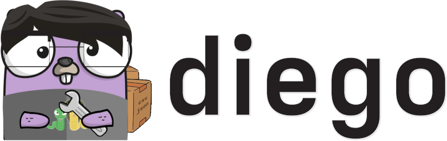

Diego is a data importer extension for [Hugo](https://gohugo.io/).

Diego integrates with Hugo as a CLI tool to assist in importing and utilizing exported social media data from various services on Hugo websites.

[](https://github.com/ttybitnik/diego/releases/latest)
[](https://github.com/ttybitnik/diego/actions/workflows/cicd.yaml)
[](https://goreportcard.com/report/github.com/ttybitnik/diego)
[](https://conventionalcommits.org)
<!-- [](https://buymeacoffee.com/ttybitnik) -->

# Overview

`diego` is a CLI tool designed to import official `CSV` and `JSON` data files from popular services like **Goodreads**, **IMDb**, **Letterboxd**, **Spotify**, and **YouTube** into **Hugo**.

`diego` provides:
- Automatic `CSV` and `JSON` conversion into [Hugo data files](https://gohugo.io/templates/data-templates/)
- Support for all Hugo data file formats
- Easy data management in a human-readable format (`YAML`)
- Automatic generation of Hugo shortcodes for imported data
- Optional scrape capabilities for fetching missing fields
- Flags suited for scripting and pipelines
- Persistent configuration

## Showcase

For a basic workflow example using `diego` to import data, see the [demonstration](docs/demonstration.md).

For real usage examples, you can check the collections section on my personal **Hugo** website. I utilize `diego` to showcase my [favorite albums](https://eternodevir.com/collections/albums/), [movies](https://eternodevir.com/collections/movies/), [music videos](https://eternodevir.com/collections/music-videos/), and [books](https://eternodevir.com/collections/books/).

# Installation

Installing `diego` is easy. You can either compile it from source or download the official binaries from the [releases](https://github.com/ttybitnik/diego/releases).

> [!TIP]
> After following the instructions for your preferred installation method, run `diego -v` to test the installed version.

## From source

If the target system has `go` installed, you can compile and install `diego` using the following command:

```shell
go install github.com/ttybitnik/diego@latest
```

## From releases

You can also install `diego` by downloading the [latest release](https://github.com/ttybitnik/diego/releases/latest) for your system and moving its binary and man pages to the appropriate system paths. Use one of the commands below to simplify this process:

> [!TIP]
> In case of uncertainty about the machine architecture, run `uname -m` to check it.

### Linux

<details>
<summary><b>x86_64</b></summary>

```shell
curl -L https://github.com/ttybitnik/diego/releases/download/v0.2.1/diego_0.2.0_Linux_x86_64.tar.gz | tar -xzvf - -C /tmp/ && cp /tmp/diego ~/.local/bin/ && cp /tmp/man/*.1 ~/.local/share/man/man1/ # x-release-please-version
```

</details>
<details>
<summary><b>arm64</b></summary>

```shell
curl -L https://github.com/ttybitnik/diego/releases/download/v0.2.1/diego_0.2.0_Linux_arm64.tar.gz | tar -xzvf - -C /tmp/ && cp /tmp/diego ~/.local/bin/ && cp /tmp/man/*.1 ~/.local/share/man/man1/ # x-release-please-version
```

</details>
<details>
<summary><b>i386</b></summary>

```shell
curl -L https://github.com/ttybitnik/diego/releases/download/v0.2.1/diego_0.2.0_Linux_i386.tar.gz | tar -xzvf - -C /tmp/ && cp /tmp/diego ~/.local/bin/ && cp /tmp/man/*.1 ~/.local/share/man/man1/ # x-release-please-version
```

</details>

### FreeBSD

<details>
<summary><b>x86_64</b></summary>

```shell
curl -L https://github.com/ttybitnik/diego/releases/download/v0.2.1/diego_0.2.0_Freebsd_x86_64.tar.gz | tar -xzvf - -C /tmp/ && cp /tmp/diego ~/.local/bin/ && cp /tmp/man/*.1 ~/.local/share/man/man1/ # x-release-please-version
```

</details>
<details>
<summary><b>arm64</b></summary>

```shell
curl -L https://github.com/ttybitnik/diego/releases/download/v0.2.1/diego_0.2.0_Freebsd_arm64.tar.gz | tar -xzvf - -C /tmp/ && cp /tmp/diego ~/.local/bin/ && cp /tmp/man/*.1 ~/.local/share/man/man1/ # x-release-please-version
```

</details>
<details>
<summary><b>i386</b></summary>

```shell
curl -L https://github.com/ttybitnik/diego/releases/download/v0.2.1/diego_0.2.0_Freebsd_i386.tar.gz | tar -xzvf - -C /tmp/ && cp /tmp/diego ~/.local/bin/ && cp /tmp/man/*.1 ~/.local/share/man/man1/ # x-release-please-version
```

</details>

### MacOS

<details>
<summary><b>x86_64</b></summary>

```shell
curl -L https://github.com/ttybitnik/diego/releases/download/v0.2.1/diego_0.2.0_Darwin_x86_64.tar.gz | tar -xzvf - -C /tmp/ && cp /tmp/diego ~/.local/bin/ && cp /tmp/man/*.1 ~/.local/share/man/man1/ # x-release-please-version
```

</details>
<details>
<summary><b>arm64</b></summary>

```shell
curl -L https://github.com/ttybitnik/diego/releases/download/v0.2.1/diego_0.2.0_Darwin_arm64.tar.gz | tar -xzvf - -C /tmp/ && cp /tmp/diego ~/.local/bin/ && cp /tmp/man/*.1 ~/.local/share/man/man1/ # x-release-please-version
```

</details>

### Windows

<details>
<summary><b>x86_64</b></summary>

```powershell
Invoke-WebRequest -Uri "https://github.com/ttybitnik/diego/releases/download/v0.2.1/diego_0.2.0_Windows_x86_64.zip" -OutFile "$env:USERPROFILE\Downloads\diego_x86_64.zip" # x-release-please-version
```

</details>

# Usage

## Getting Started

Once installed, run `diego` and follow the instructions to start using it.

Run either `diego help [command]` or `diego [command] -h` to discover more about a specific command.

For complete details on using `diego`, read the [Diego User Guide](docs/user_guide.md).

## Commands

- [diego completion](docs/user_guide.md#diego-completion) :: generate the autocompletion script for the specified shell
- [diego import](docs/user_guide.md#diego-import) :: import data from various services into Hugo
  - [diego import goodreads](docs/user_guide.md#diego-import-goodreads) :: import data from Goodreads
  - [diego import imdb](docs/user_guide.md#diego-import-imdb) :: import data from IMDb
  - [diego import letterboxd](docs/user_guide.md#diego-import-letterboxd) :: import data from Letterboxd
  - [diego import spotify](docs/user_guide.md#diego-import-spotify) :: import data from Spotify
  - [diego import youtube](docs/user_guide.md#diego-import-youtube) :: import data from YouTube
- [diego set](docs/user_guide.md#diego-set) :: set a configuration option
  - [diego set all](docs/user_guide.md#diego-set-all) :: enable or disable the all flag by default
  - [diego set defaults](docs/user_guide.md#diego-set-defaults) :: restore Diego default settings
  - [diego set format](docs/user_guide.md#diego-set-format) :: set output format for the Hugo data file (default "yaml")
  - [diego set hugodir](docs/user_guide.md#diego-set-hugodir) :: set path to the Hugo directory (default ".")
  - [diego set overwrite](docs/user_guide.md#diego-set-overwrite) :: enable or disable the overwrite flag by default
  - [diego set scrape](docs/user_guide.md#diego-set-scrape) :: enable or disable the scrape flag by default
  - [diego set shortcode](docs/user_guide.md#diego-set-shortcode) :: enable or disable the shortcode flag by default
- [diego settings](docs/user_guide.md#diego-settings) :: show current settings

## Supported Services and Files

- [Goodreads](docs/user_guide.md#goodreads)
- [IMDb](docs/user_guide.md#imdb)
- [Letterboxd](docs/user_guide.md#letterboxd)
- [Spotify](docs/user_guide.md#spotify)
- [YouTube](docs/user_guide.md#youtube)

# Contributing

To request support for a new service or file, submit a [feature request](https://github.com/ttybitnik/diego/issues/new?assignees=&labels=enhancement&projects=&template=feature_request.md&title=) with a small sample of the official exported file.

In case of unexpected behavior, please open a [bug report](https://github.com/ttybitnik/diego/issues/new?assignees=&labels=bug&projects=&template=bug_report.md&title=).

To contribute to `diego` development, refer to the [contributing instructions](CONTRIBUTING.md).

# License

This project is licensed under the GNU General Public License v3.0 (GPL-3.0), **unless an exception is made explicit in context**. The GPL is a copyleft license that guarantees the freedom to use, modify, and distribute software. It ensures that users have control over the software they use and promotes collaboration and sharing of knowledge. By requiring that derivative works of GPL-licensed software also be licensed under the GPL, the license ensures that the freedoms it provides are extended to future generations of users and developers.

See the `COPYING` file for more information.
